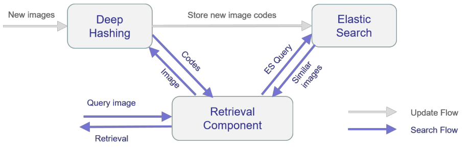
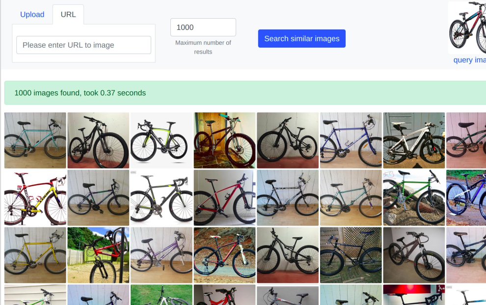

# ElasticHash: Semantic Image Similarity Search in Elasticsearch

ElasticHash uses ElasticSearch for high-quality, efficient, and large-scale semantic image similarity search. 
It is based on a deep hashing model to learn hash codes for fine-grained image similarity search in natural images and a
two-stage method for efficiently searching binary hash codes using Elasticsearch (ES). 
In the first stage, a coarse search based on short hash codes is performed using multi-index hashing and ES terms lookup 
of neighboring hash codes. In the second stage, the list of results is re-ranked by computing the Hamming distance on 
long hash codes.



## Demo 



https://uni-marburg.de/ntzdY

## Usage

Perform image similarity search on ~7M images of the OpenImages dataset.

* Go to app directory `cd dh`
* Download model and unpack `./get_model.sh`
* Start containers:
    - Run on CPU: `docker-compose up -d`
    - Or, if a GPU is available, run on GPU: `docker-compose --env-file ./.env.gpu up -d`
* Download OpenImages ES index and import data into ES: `docker exec dh_app /tools/import_openimages.sh`
* Go to http://localhost

## Custom image dataset

You can also perform image similarity search on a custom image dataset. However, for reasonable results, this requires a
directory with enough images to index.

* Go to app directory `cd dh`
* Customize `docker-compose.yaml`: Add `- path/to/mage_dir/:/app/static/images/` for a path to a folder containing images
  to `app`
* Start containers `docker-compose up -d`
* Customize and run `docker exec dh_app /tools/import_dir.sh`
* Go to http://localhost

## Custom model

You can also use a custom deep hashing model (e.g. for other domains). For an example how to convert a Keras model for 
tensorflow serving see ``

## Troubleshooting

If the elasticsearch container won't start its probably a permissions issue: `sudo chown 1000:1000 -R dh/elasticsearch/data/`

## Reference

Reference to cite when you use ElasticHash in a research paper:

```
@InProceedings{korfhage2021elastichash,
  title="ElasticHash: Semantic Image Similarity Search by Deep Hashing with Elasticsearch",
  author={Korfhage, Nikolaus and M{\"u}hling, Markus and Freisleben, Bernd},
  booktitle="Computer Analysis of Images and Patterns",
  year="2021",
  publisher="Springer International Publishing",
  pages="14--23",
}
```

## License

ElasticHash is MIT-licensed

## Credits

The demo app uses [Natural Gallery JS](https://github.com/Ecodev/natural-gallery-js) and [PhotoSwipe](https://photoswipe.com/) and images from the [Open Images dataset](https://storage.googleapis.com/openimages/web/index.html)

